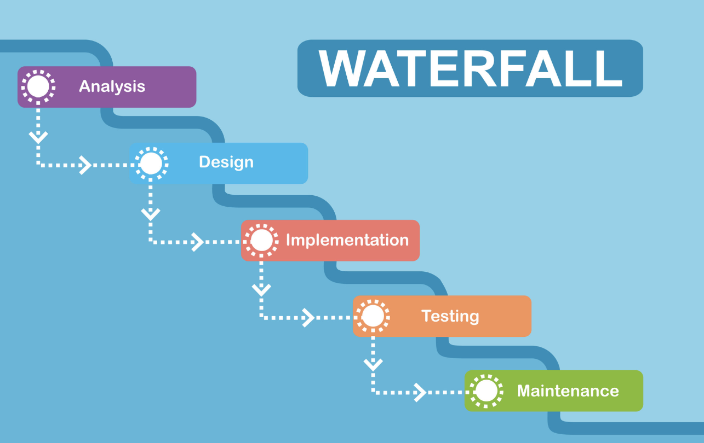
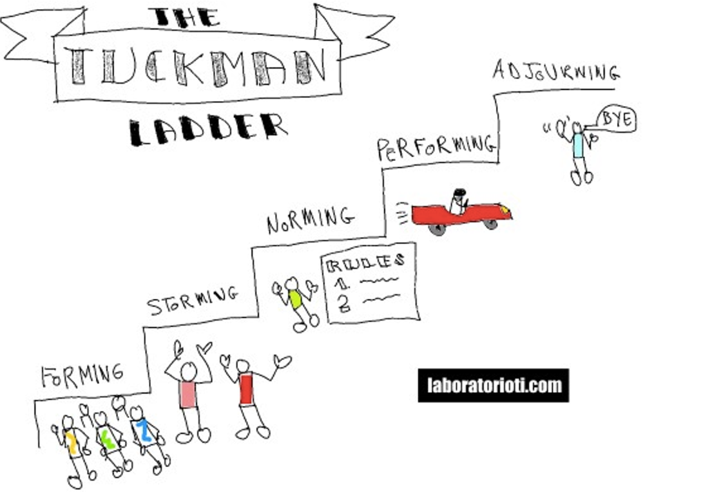
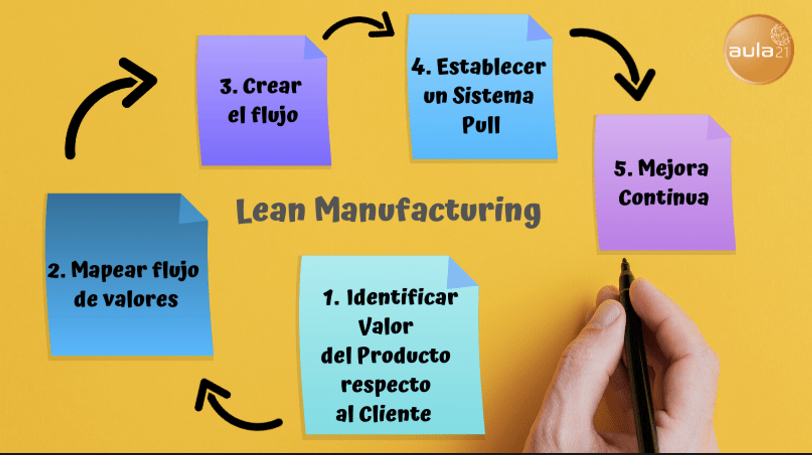

# Taller de Scrum 🚀

> **MATERIAL PARA ALUMNOS DE DATA SCIENCE**
> 

> **REALIZADO EN THE BRIDGE | DIGITAL TALENT ACCELERATOR**
> 

### Autor:

**Marta Gómez Jiménez (SMC®)** Scrum Master Certified

- **Contacto**
    
    🐱 Github
    
    [martagomezz - Overview](https://github.com/martagomezz)
    
    🖇️ LinkedIn 
    
    [Marta Gómez Jiménez - Data Science TA - The Bridge | Digital Talent Accelerator | LinkedIn](https://www.linkedin.com/in/martagomezjimenez/)
    

---

# Contexto

> *Vivimos en un mundo complejo en constante crecimiento.*
> 

- **Gestión y desarrollo de proyectos de forma tradicional**
    - **Metodología Waterfall o Cascada**
        
        Es un método para la gestión de un proyecto de forma lineal donde los requisitos de los stakeholders, especialmente los clientes, se recopilan al inicio del proyecto para luego diseñar un plan secuencial que se adecúe a ellos.
        
        
        
    
    - **Project Management Professional (PMI - PMBoK® Guide)**
        1. Recopilación y Análisis de requisitos.
        2. Planificación del proyecto
        3. Ejecución del proyecto
        4. Monitorización y Control (cambios)
        5. Cierre (análisis de resultados)
    
    - **Desventajas**
        - Imposibilidad de cambiar los requisitos una vez se ha iniciado el desarrollo del proyecto.
        - Admite cambios en los requisitos de desarrollo del proyecto aunque la planificación inicial ya se haya completado pero estos tienen un impacto en el cronograma y el presupuesto.
        - La fase de pruebas sólo se produce al final del proyecto.
        - Hay recursos del equipo parados ya que no pueden iniciar su parte hasta que el equipo responsable de la fase anterior finalice.

# INTRODUCCIÓN

- **Agile**
    - **¿Qué NO es Agile?**
        
        Agile NO es una metodología. Un método es algo rígido y ordenado que se debe seguir de forma sistemática para llegar a un resultado o fin determinado.
        
    
    - **¿Qué es Agile?**
        
        Es un enfoque (marco o entorno) de trabajo que permite a los equipos la capacidad de adaptarse de una forma más rápida y fácil a los cambios o nuevos requisitos que surgen en el desarrollo de un proyecto.
        
    
    - **Manifiesto ágil**
        
        Pese a que hay muchas referencias anteriores, Agile tiene su inicio en 2001 con la creación del Manifiesto Agile (Utah) para el desarrollo de software.  
        
        Actualmente se aplica a proyectos de todo tipo.
        
        **Objetivo**
        
        Una mejor manera de comercializar los productos más rápido, aceptando los cambios en los proyectos sin que estos repercutan significativamente en el coste o retrasen el cronograma.
        
        - **Los 12 principios del Manifiesto Agil**
            
            [Principios del Manifiesto Ágil](https://agilemanifesto.org/iso/es/principles.html)
            

- **Trabajo en equipo**
    - **La escalera de Tuckman**
        - Formación (forming)
        - Roces (storming)
        - Normalización (norming)
        - Máximo rendimiento (performing)
        - Despedida o duelo (adjourning)
        
        
        
    
    - **Mentalidad**
        - Agile sé es, es una forma de pensar y actuar.
        - No se buscan culpables, se buscan soluciones.
        - Educación en positivo frente a la cultura del castigo.
        - Hay que prestar ayuda sin que me la pidan, anticiparse por el bien del equipo y del proyecto.
        - Todos a una.

---

# SCRUM

- **Intro a Scrum**
    
    
    
    - **Definición (Melé)**
        
        Scrum es un marco (framework) ligero que ayuda a las personas, equipos y organizaciones a generar valor a través de soluciones adaptables para problemas complejos.
        
    
    - **Teoría Scrum**
        - Scrum es simple y deliberadamente incompleto, solo define las partes teóricas necesarias.
        - Scrum se basa en la inteligencia colectiva de las personas,  guía sus relaciones e interacciones.
        - Scrum se basa en el empirismo y el pensamiento Lean.
        
        
        
    
    - **Objetivos**
        - Entregarse, desarrollarse y mantenerse de forma incremental.
        - Gestión del conocimiento y la experiencia del equipo.
        - Mejora continua, transparencia y trabajo en equipo.
    
    - **Pilares (TIA)**
        - [Transparencia](https://scrumguides.org/scrum-guide.html#transparency) (confianza)
        - [Inspección](https://scrumguides.org/scrum-guide.html#inspection) (autoevaluación)
        - [Adaptación](https://scrumguides.org/scrum-guide.html#adaptation) (flexibilidad)
    
    - **Valores**
        - Compromiso / Commitment
        - Foco / Focus
        - Apertura / Openness
        - Respeto / Respect
        - Valor / Courage
    
    - **Equipo**
        - [Developers](https://scrumguides.org/scrum-guide.html#developers)
        - [Product Owner](https://scrumguides.org/scrum-guide.html#product-owner)
        - [Scrum Master](https://scrumguides.org/scrum-guide.html#scrum-master)
    
    - **Eventos**
        - [The Sprint](https://scrumguides.org/scrum-guide.html#the-sprint) (recomendado 1 mes)
        - [Sprint Planning](https://scrumguides.org/scrum-guide.html#sprint-planning) (máx. 8 horas para Sprint de 1 mes)
        - [Daily Scrum](https://scrumguides.org/scrum-guide.html#daily-scrum) (15 minutos)
        - [Sprint Review](https://scrumguides.org/scrum-guide.html#sprint-review) (máx. 4h para Sprint de 1 mes)
        - [Sprint Retrospective](https://scrumguides.org/scrum-guide.html#sprint-retrospective) (máx. 3h para Sprint de 1 mes)
        
        > *“Lo que pasa en las retros, se queda en las retros”*
        > 
    
    - **Artefactos**
        - [Product Backlog](https://scrumguides.org/scrum-guide.html#product-backlog) (requerimientos ordenados)
        - [Sprint Backlog](https://scrumguides.org/scrum-guide.html#sprint-backlog) (descomposción / paquetización)
        - [Incremento](https://scrumguides.org/scrum-guide.html#increment) (mejora continua, aporte de valor)

- **Certificaciones**
    - [Scrum.org](http://Scrum.org)
        
        Certificación americana.
        
        La más reconocida internacionalmente. 
        
        80 preguntas en 60 minutos (20 minutos para repaso)
        
        Aprox. 150€ 1 intento. (inglés)
        
        No caduca.
        
        No penalizan las preguntas erróneas.
        
        Algunas preguntas son multiple choice (avisa)
        
    
    - [European Scrum](https://www.europeanscrum.org/inicio.html)
        
        Certificación disponible en Español. 
        
        40 preguntas en 30 minutos (10 minutos para repaso)
        
        150€ 2 intentos. 
        
        Se renueva cada año (25€), demuestra que estás actualizado. 
        
        No penalizan las preguntas erróneas.
        
        Algunas preguntas son multiple choice (no avisa).
        

# PARTE III

- **Diagramas de flujo, kanban y sprints**
    
    [Intro_scrum](https://miro.com/app/board/o9J_llVyR4k=/?invite_link_id=738393240487)
    
- **Trello**
    
    [Trello](https://trello.com/b/UXOzHnt1/proyectos-bt-ds)
    
- **Asana**
    
    
    
- **Jira**
    
    [Jira | Software de seguimiento de proyectos e incidencias](https://www.atlassian.com/es/software/jira)
    
- **Notion**
- **Taller de Scrum**
    
    [Tarea Scrum (**Bulletproof**) ](https://www.notion.so/Tarea-Scrum-Bulletproof-01be51e6c546492a951d4361a54e5446?pvs=21)
    

---

# Otros

- Recursos
    
    [Scrum: qué es, cómo funciona y por qué es excelente](https://www.atlassian.com/es/agile/scrum)
    
- Documentación
    
    [Scrum Guide | Scrum Guides](https://scrumguides.org/scrum-guide.html)